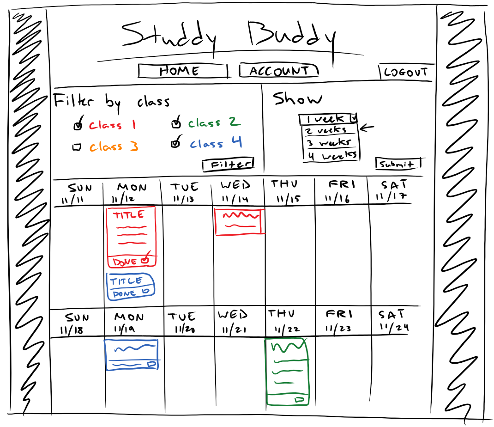
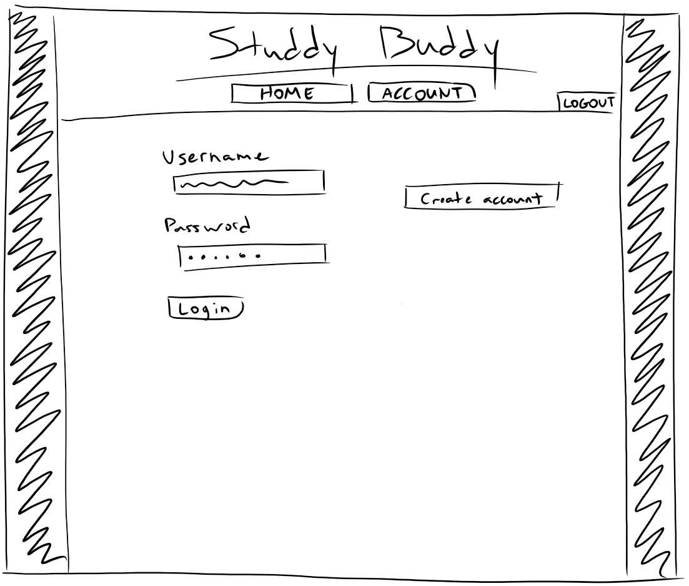
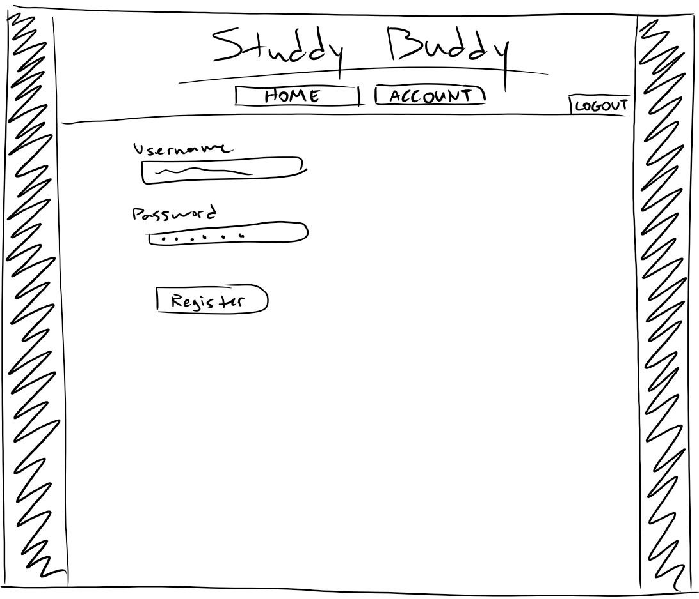
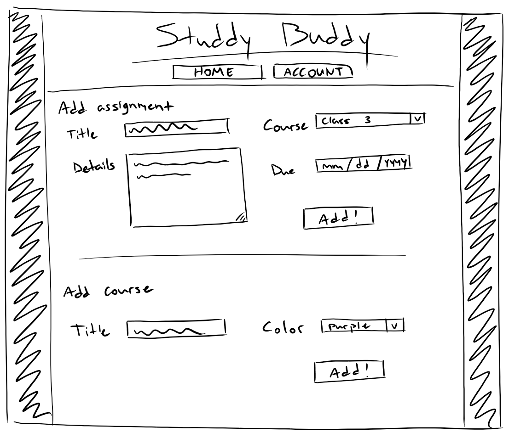
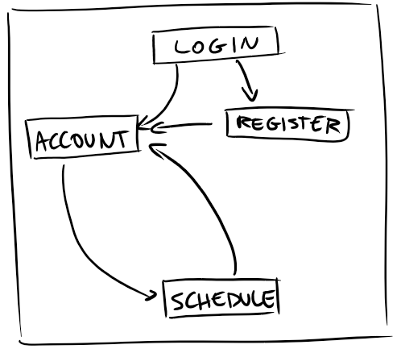

# Study Buddy

## Description

I had a lot of trouble finding a suitable homework organizer app for my needs. I really just want homework tracking, but most of them were too bloated with extra features I had no interest in. And task managers that aren't purpose built for homework are too general. I'm hoping this organizer will be the happy middleground. Users create classes, and add assignments with due dates and descriptions within each class. And this can be viewed in a simple color-coded schedule without any clutter.

## Data Model

The app will store Users, Classes, and Assignments. Each user account has a set of classes associated with them (via references). And each class holds multiple assignments

An example user:

```javascript
// username, salt, and hash fields are added by passport-local-mongoose plugin
{
    username: "Name Here",
    hash: // a password hash
    salt: // salt for hash
    courses: [CourseSchema]// an array of courses the user has set up
}
```

An example class:

```javascript
{
    title: "Applied Internet Technology",
    color: "red" // for color coding assignments
    assignments: // array of embedded assignment objects (es6 class)
}
```

And an example assignment:

```javascript
{
    title: "Final Project",
    details: "Assignment description/details.",
    due: 2018-11-30,
    done: false // true when you check it off
}
```

[First draft schemas](db.js)

## Wireframes

/schedule  -  page showing schedule with filter options



/login  -  login page for those with an account



/register  -  account creation page for unregistered users



/courses - add or delete a course

/assignments - add an assignment to a course

Slightly out of date wireframe, pages have been split up.




## Site Map

Out of date, assignment and course management pages should both point to and from home.



## Use Cases

* As an unregistered user, I can create an account.

* As a user, I can log into my account.

* As a user, I can add and remove courses.

* As a user, I can create assignments and add them to courses.

* As a user, I can view a filtered schedule of my assignments and check them off.


## Research Topics

Implemented research topics:

(3 points) passport, passport-local, passport-local-mongoose

* Used to handle user login and registration, as well as session management.

(3 points) Client-side form validation with custom JS/library   

* Integrated into the DOM

* Validates registration forms as well as adding assignments and course forms.
