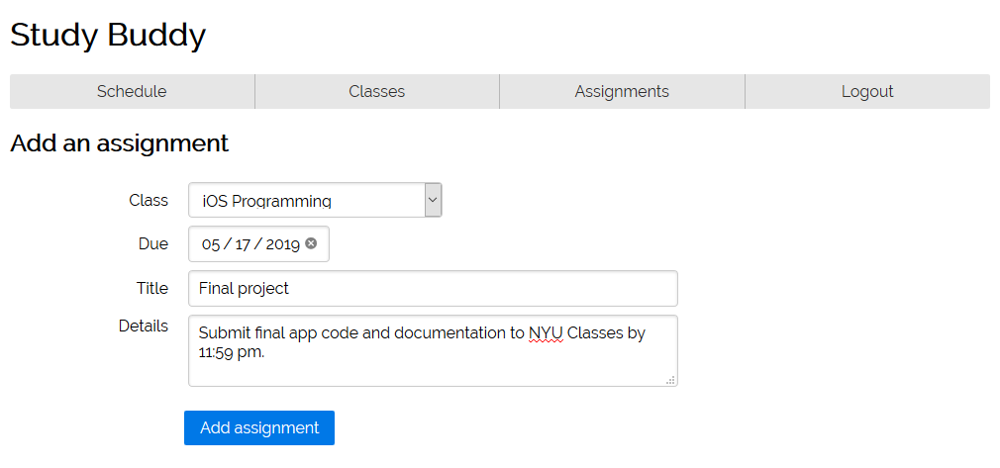
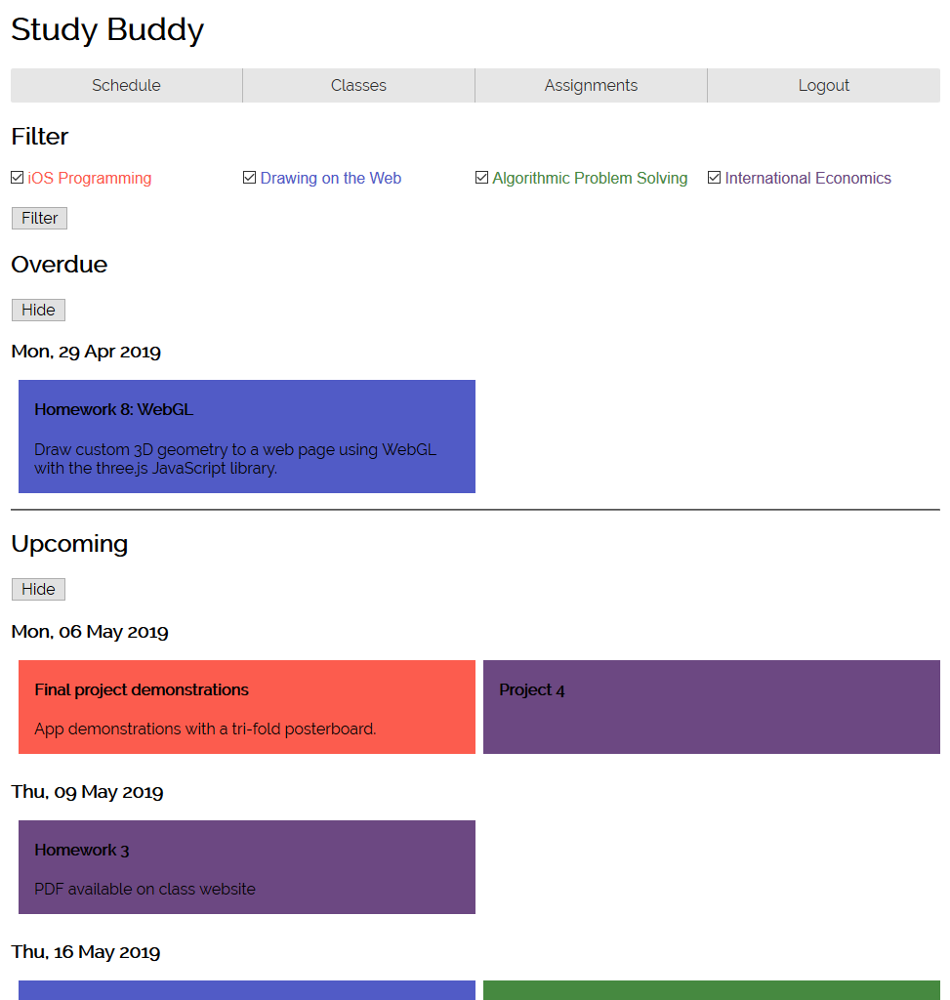

# Study Buddy

## Description

A simple web application for students to track homework. Allows users to create accounts, add courses, and input assignments with titles, descriptions, and due dates. Express web application with session management, Passport authentication, and a MongoDB back end.  Currently under active development.

## Screenshots

